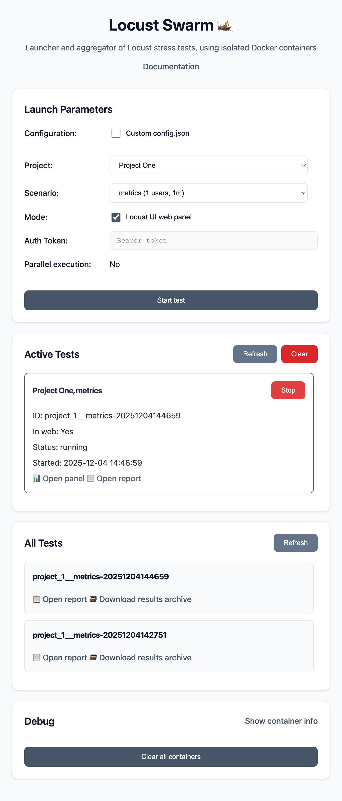

# LocustSwarm

**Launcher and aggregator of Locust load tests in Docker containers**

## About

LocustSwarm is a web-based interface for managing and orchestrating Locust load tests with Docker container isolation. Each test runs in its own isolated Docker container, ensuring complete separation and preventing interference between different test scenarios.

### Key Features

- 🐳 **Docker Isolation** - Each test runs in a separate container for complete isolation
- 🎯 **Multiple Scenarios** - Support for predefined and custom multi-stage load scenarios
- 📊 **Web Interface** - User-friendly web UI for managing tests and viewing results
- 🔄 **Real-time Monitoring** - Track active tests and access Locust web panels
- 📁 **Results Management** - Automatic collection and archiving of test results
- ⚙️ **Flexible Configuration** - JSON-based configuration for projects and scenarios

### Use Cases

- Load testing of web applications and APIs
- Performance testing with isolated test environments
- Multi-project test management
- Custom load patterns with stage-based scenarios

# Quick Start

## 1. Creating Virtual Environment and Installing Dependencies

### Method A: Using UV
#### Install UV
```bash
curl -LsSf https://astral.sh/uv/install.sh | sh
```

#### Creating Virtual Environment and Installing Dependencies
```bash
uv sync

# Activate virtual environment (optional)
source .venv/bin/activate  # Linux/macOS
# or
.venv\Scripts\activate     # Windows
```

### Method B: Using Standard venv
```bash
# Creating virtual environment for Python 3.11
python3.11 -m venv .venv

# Activate virtual environment
source .venv/bin/activate  # Linux/macOS
# or
.venv\Scripts\activate     # Windows

# Install dependencies via pip
pip install -r requirements.txt

# Or if using pyproject.toml
pip install .
```

## 2. Configuration
```bash
# Copy and fill in the configuration example
cp config.example.json config.json
# Edit config.json according to your needs
```

**Note:** keys in config.json must match folder names in `tests/`

## 3. Running the Application

### Development
```bash
# With activated virtual environment
uv run flask --app app run --port 3000 --debug --exclude-patterns="*/tmp/*"

# Or with activated venv directly
flask --app app run --port 3000 --debug --exclude-patterns="*/tmp/*"
```

#### Docker
```bash
docker context ls
docker context use <NAME>
docker ps -all
docker logs <CONTAINER_ID>
```

## 4. Production

### Stopping Previous Process (Linux/macOS)
```bash
fuser -k 3000/tcp
```
*For Windows use:*
```cmd
netstat -ano | findstr :3000
taskkill /PID <PID> /F
```

### Running in Production Mode

#### Method A: Using UV
```bash
uv run gunicorn -c gunicorn.conf.py app:app
```

#### Method B: Using Standard venv
```bash
# Make sure virtual environment is activated
gunicorn -c gunicorn.conf.py app:app
```

The application will be available at: **http://127.0.0.1:3000**

---

**Note:** For complete information about the project, environment variables configuration, and settings, refer to the [documentation](/DOCS.md).
